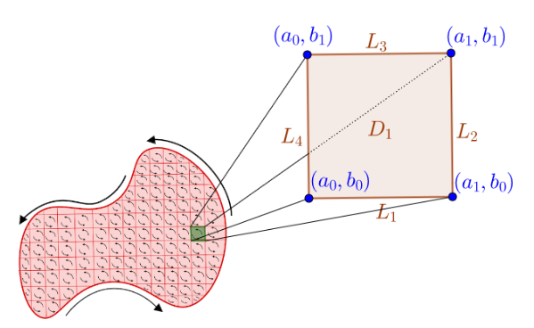

<!--more-->

$$\begin{align*}
\newcommand{\dif}{\mathop{}\!\mathrm{d}}
\newcommand{\p}{\partial}
\end{align*}
$$

# 环量

***环量***
: 在矢量场$\vec{A}$ 中，矢量 $\vec{A}$ 沿某一闭合路径的线积分，定义为该矢量沿此闭合路径的**环量（circulation）**，记作：

$$
\Gamma=\oint_c \vec{A} \cdot \dif \vec{l}=\oint_c A\cos\theta\dif l
$$

# 环量面密度

过点 $P$ 作一微小曲面 $\Delta S$，沿其边界做环量积分，方向符合右手法则，当 $\Delta S \rightarrow P$ 时，存在极限：

$$
\frac{\dif \Gamma}{\dif S} = \lim_{\Delta S \rightarrow 0} \frac{1}{\Delta S} \oint_{\Delta L} \vec{A}\cdot\dif \vec{l}
$$

则将此极限定义为 **环量面密度**。

# 旋度

***旋度***
: 矢量 $\vec{A}$ 的 **旋度（rotation）** 记为 $\text{rot} A$定义为：
: $$
\text{rot}\vec{A}\cdot \vec{n}=\lim_{\Delta S\rightarrow 0} \frac{\oint_c \vec{A}\cdot\dif \vec{l}}{\Delta S}
$$

计算公式：

`直角坐标`{:.success}

$$
\nabla \times A=
\begin{vmatrix}
\vec{a}_x & \vec{a}_y & \vec{a}_x\\
\frac{\p}{\p x} & \frac{\p}{\p y} & \frac{\p}{\p z}\\
A_x & A_y & A_z
\end{vmatrix}
$$

`柱坐标`{:.success}

$$
\nabla \times A=
\begin{vmatrix}
\frac{\vec{a}_r}{r} & \vec{a}_\varphi & \frac{\vec{a}_z}{r}\\
\frac{\p}{\p r} & \frac{\p}{\p \varphi} & \frac{\p}{\p z}\\
A_r & rA_\varphi & A_z
\end{vmatrix}
$$

`球坐标`{:.success}

$$
\nabla \times A=
\begin{vmatrix}
\frac{\vec{a}_r}{r^2\sin\theta} & \frac{\vec{a}_\theta}{\theta} & \frac{\vec{a}_\varphi}{r}\\
\frac{\p}{\p r} & \frac{\p}{\p \theta} & \frac{\p}{\p \varphi}\\
A_r & rA_\theta & r\sin\theta A_\varphi
\end{vmatrix}
$$

记忆方法还是和前面散度一样的：

$$
\nabla\times A=
\begin{vmatrix}
\frac{\vec{a}_1}{h_2h_3} & \frac{\vec{a}_2}{h_1h_3} & \frac{\vec{a}_3}{h_1h_2}\\
\frac{\p}{\p u_1} & \frac{\theta}{\p u_2} & \frac{\p}{\p u_3}\\
h_1F_1 & h_2F_2 & h_3 F_3
\end{vmatrix}
$$

其中，$F_1,F_2,F_3$ 就是矢量场的各个分量，$h_1,h_2,h_3$ 是 Lame系数，通俗来讲就是长度元表达式的系数：
1. 对柱坐标系：$h_1=1, h_2=r, h_3=1$
2. 对球坐标系：$h_1=1, h_2=r, h_3=r\sin\theta$

---

旋度的性质：
1. $\nabla\times \vec{C}=\vec{0}$
2. $\nabla\times(C\vec{F})=C\nabla\times\vec{F}$
3. $\nabla\times(\vec{F}\pm\vec{G})=\nabla\times\vec{F} \pm \nabla\times \vec{G}$
4. $\nabla\times(u\vec{F})=u\nabla\times\vec{F}+\nabla u\times\vec{F}$
5. $\nabla\cdot(\vec{F}\times\vec{G})=\vec{G}\cdot(\nabla\times\vec{F})-\vec{F}\cdot(\nabla\times\vec{G})$  [证明](https://blog.csdn.net/xiong_xin/article/details/102313273)

# 重要恒等式

1. 梯度的旋度恒为0（证明方法：$\dfrac{\p^2u}{\p x\p y}=\dfrac{\p^2u}{\p y\p x}）$
   
   $$
   \text{rot}(\text{grad}\,u)=\nabla\times\nabla u=0
   $$
2. 旋度的散度恒为0（证明方法同上）

   $$
   \text{div}(\text{rot}\vec{A})=\nabla\cdot(\nabla\times\vec{A})=0
   $$

由上我们可知，如果某个矢量场：
1. 旋度=0，可表示为标量函数的梯度 $\nabla u$
2. 散度=0，可表示为矢量函数的旋度 $\nabla\times \vec{A}$

**🚩注意** 我们可以通过 **“梯、旋、散”** 来记忆。后面我们统一用 梯旋散公式 指代上面一系列的结论。

# 斯托克斯公式

$$
\oint_c \vec{A}\cdot\dif\vec{l} = \int_S\nabla\times\vec{A}\cdot\dif\vec{S}
$$

