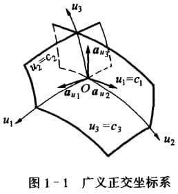
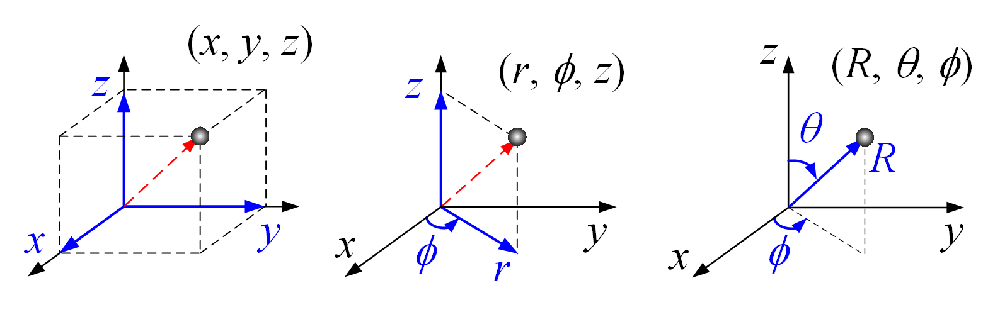
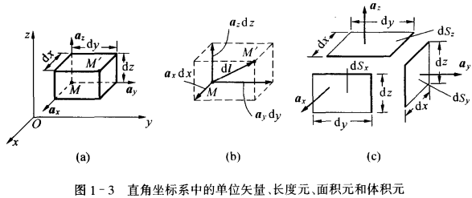
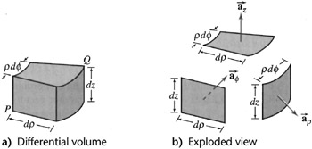
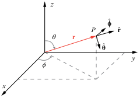
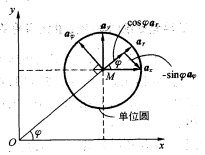

<!--more-->
$$
\newcommand{\dif}{\mathop{}\!\mathrm{d}}
\newcommand{\p}{\partial\,}
$$

***场***：
: 若在空间中，每一点上都对应着某个物理量的确定值，则在这个空间域中确定了该物理量的场
: 如果物理量为矢量，则为**矢量场**；若为标量，则为**标量场**
: 如果物理量不随时间变换，则为**静态场**，反之为**动态场**

## 坐标系

### 基本知识

***坐标系***：
: 空间中的每个点，均可用唯一一组标量表示出来，该系统就叫坐标系
: 对于 N 维空间，需要 N 个独立坐标变量

***坐标面***：
: 当一个坐标变量等于某个常数时，形成的曲面或平面

***坐标曲线***：
: 每两组坐标面的交线

***正交坐标系***：
: 过空间任意点，三条坐标曲线都互相正交的坐标系

***坐标单位矢量***：
: 过空间任意点M的三条坐标曲线的切向单位矢量
: 其模为1，以各坐标变量*增加方向*作为正方向
: 一个正交坐标系的坐标单位矢量相互正交并满足右手螺旋法则

下图中展示了一个以 $u_1, u_2, u_3$ 为轴的坐标系，其对应得坐标面$c_1, c_2, c_3$，坐标曲线$u_1, u_2, u_3$，坐标单位矢量 $\hat{a}\_{u1}, \hat{a}\_{u2}, \hat{a}_{u3}$

### 三种坐标系

***直角坐标系 Cartesian Coordinates***
: 坐标变量：$x, y , z \; (\infty < x,y,z < \infty)$
: 任意矢量 $\vec{A}$ 表示为：$\vec{A} = A_x \hat{a}_x + A_y \hat{a}_y + A_z \hat{a}_z$
: 长度元：$\dif \vec{l} = \hat{a}_x \dif  x + \hat{a}_y \dif  y + \hat{a}_z \dif  z$
: 面积元：
: $$\begin{align} 
\dif  \vec{S} &= \dif  S_x + \dif  S_y + \dif  S_z \\
&= \hat{a}_x \dif  y \dif  z + \hat{a}_y \dif  z \dif  x + \hat{a}_z \dif  x \dif  y \end{align}
$$
: 体积元：$\dif  V = \dif x\dif y\dif z$

***圆柱坐标系 Cylindrical Coordinates***
: 坐标变量：$(r, \varphi, z) \; (0 \leq r < +\infty, 0 \leq \varphi \leq 2\pi, -\infty < z < +\infty)$
: 任意矢量 $\vec{A}$ 表示为：$\vec{A} = A_r \hat{a}_r + A_φ \hat{a}_φ + A_z \hat{a}_z$
: 长度元：
: $$
\begin{align}
\dif  \vec{l} &= \dif  \vec{l}_r + \dif  \vec{l}_\varphi + \dif  \vec{l}_z\\
&= \hat{a}_r \dif  r + \hat{a}_\varphi r \dif  \varphi + \hat{a}_z \dif  z
\end{align}
$$
: 面积元：
: $$
\begin{align}
\dif  \vec{S} &= \hat{a}_r \dif  S_r + \hat{a}_\varphi \dif  S_\varphi + \hat{a}_z \dif  S_z\\
&= \hat{a}_r r \dif \varphi \dif z + \hat{a}_\varphi \dif r \dif z + \hat{a}_z r \dif r \dif \varphi
\end{align}
$$
: 体积元：$\dif  V = \dif  l_r \dif  l_\varphi \dif  z = r \dif  r \dif  \varphi \dif  z$

***球坐标系 Spherical Coordinates***
: $(r, \theta, \varphi) \; (0 \leq r < +\infty, 0 \leq \theta \leq \pi, 0 \leq \varphi \leq 2\pi)$
: 任意矢量 $\vec{A}$ 表示为：$\vec{A} = A_r \hat{a}_r +  A_θ \hat{a}_θ + A_φ \hat{a}_φ$
: 长度元：
: $$
\begin{align}
\dif  \vec{l} &= \dif  \vec{l}_r + \dif  \vec{l}_\theta + \dif  \vec{l}_\varphi\\
&= \hat{a}_r \dif  r + \hat{a}_\theta r \dif  \theta + \hat{a}_\varphi r \sin \theta \dif  \varphi
\end{align}
$$
: 面积元：
: $$
\begin{align}
\dif  \vec{S} &= \hat{a}_r \dif  S_r + \hat{a}_\theta \dif  S_\theta + \hat{a}_\varphi \dif  S_\varphi \\
&= \hat{a}_r r^2 \sin\theta \dif  \theta \dif  \varphi + \hat{a}_\theta r \sin\theta \dif  r \dif  \theta + \hat{a}_\varphi r \dif  r \dif  \theta
\end{align}
$$
: 体积元：$ \dif V = \dif l_r \dif l_\theta \dif l_\varphi = r^2 \sin \theta \dif r \dif \theta \dif \varphi$

**🚩注意** 
1. 以上三个坐标系的坐标单位矢量均是正交的
2. 相比起直接记公式，记图反而更容易理解。而且很显然，后两者都是用各自坐标把 x,y,z 表示出来，比如：

$$
\begin{cases}
\dif x\\
\dif y\\
\dif z
\end{cases}\Rightarrow
\begin{cases}
\dif r\\
r\dif \varphi\\
\dif z
\end{cases}\Rightarrow
\begin{cases}
\dif r\\
r\sin\theta \varphi\\
r\dif \theta
\end{cases}
$$

### 坐标变量之间的关系

`直角与柱`{:.success}
$$
\begin{cases}
x = r \cos \varphi\\
y = r \sin \varphi\\
z = z
\end{cases}
\Longleftrightarrow
\begin{cases}
r = \sqrt{x^2 + y^2}\\
\varphi = \arctan \frac{y}{x}\\
z = z
\end{cases}
$$

`直角与球`{:.success}
$$
\begin{cases}
x = R \sin \theta \cos \varphi\\
y = R \sin \theta \sin \varphi\\
z = R \cos \theta
\end{cases}
\Longleftrightarrow
\begin{cases}
R = \sqrt{x^2 + y^2 + z^2}\\
\theta = \arccos \frac{z}{R}\\
\varphi = \arctan \frac{y}{x}\\
\end{cases}
$$

`柱与球`{:.success}
$$
\begin{cases}
r = R\sin\theta\\
\varphi = \varphi\\
z = R\cos\theta
\end{cases}
\Longleftrightarrow
\begin{cases}
R = \sqrt{r^2+z^2}\\
\theta = \arcsin \frac{r}{R} = \arccos\frac{z}{R}\\
\varphi = \varphi
\end{cases}
$$

### 坐标单位矢量之间的关系

`直角与柱`{:.success}
$$
\begin{bmatrix}
\hat{a}_x \\ \hat{a}_y \\ \hat{a}_z
\end{bmatrix}=
\begin{bmatrix}
\cos\varphi & -\sin\varphi & 0\\
\sin\varphi & \cos\varphi & 0\\
0 & 0 & 1
\end{bmatrix}
\begin{bmatrix}
\hat{a}_r \\ \hat{a}_\varphi \\ \hat{a}_z
\end{bmatrix}
$$，
$$
\begin{bmatrix}
\hat{a}_r \\ \hat{a}_\varphi \\ \hat{a}_z
\end{bmatrix}=
\begin{bmatrix}
\cos\varphi & \sin\varphi & 0\\
-\sin\varphi & \cos\varphi & 0\\
0 & 0 & 1
\end{bmatrix}
\begin{bmatrix}
\hat{a}_x \\ \hat{a}_y \\ \hat{a}_z
\end{bmatrix}
$$

`柱与球`{:.success}
$$
\begin{bmatrix}
\hat{a}_r \\ \hat{a}_\varphi \\ \hat{a}_z
\end{bmatrix}=
\begin{bmatrix}
\sin\theta & \cos\theta  & 0\\
0 & 0 & 1\\
\cos\theta & -\sin\theta & 0
\end{bmatrix}
\begin{bmatrix}
\hat{a}_R \\ \hat{a}_\theta \\ \hat{a}_\varphi
\end{bmatrix}
$$，
$$
\begin{bmatrix}
\hat{a}_R \\ \hat{a}_\theta \\ \hat{a}_\varphi
\end{bmatrix}=
\begin{bmatrix}
\sin\theta & 0  & \cos\theta\\
\cos\theta & 0 & -\sin\theta\\
0 & 1 & 0
\end{bmatrix}
\begin{bmatrix}
\hat{a}_r \\ \hat{a}_\varphi \\ \hat{a}_z
\end{bmatrix}
$$

`直角与球`{:.success} 并没有一个很直观的推导方法，最好是用柱来中转。

**🚩注意** 

1. 单位矢量转换与坐标变量转换的思路是完全不同的。
   * 坐标变量转换：利用已知的坐标通过几何运算得到未知坐标
   * 单位矢量转换：将未知矢量投影到已知矢量得到系数
2. 记的时候只需要记图的两个轴：$x$ 和 $y$、$r$ 和 $z$

## 矢量

矢量在高中、线代中已经学过，这里就直接列一些重要的。

***矢量***
: 矢量是由大小和方向的量。表示为 $\vec{A} = \vec{a}_AA$，其中，$A = \vert\vec{A}\vert$，称为 $\vec{A}$ 的模或长度；$\vec{a}_A$ 是沿 $\vec{A}$ 方向的单位矢量。

***位置矢量***
: 从原点指向空间一点 $P$ 的矢量称为 $P$ 的位置矢量，常用球坐标中的 $\vec{r}$ 表示

***矢量运算***
: （1）矢量加减运用三角法则
: （2）矢量点积 $\vec{A}\cdot\vec{B}$，满足交换律和分配律
: （3）矢量叉积 $\vec{A}\times\vec{B}$，满足分配律但不满足交换律（需要加负号），可用行列式计算。
: （4）标量三重积 $\vec{A}\cdot(\vec{B}\times\vec{C})$<!---->$=\vec{C}\cdot(\vec{A}\times\vec{B})$<!---->$=\vec{B}\cdot(\vec{C}\times\vec{A})$
: （5）矢量三重积 $\vec{A}\times(\vec{B}\times\vec{C})$<!---->$=\vec{B}(\vec{A}\cdot\vec{C})-\vec{C}(\vec{A}\cdot\vec{B})$，助记：英文谐音 BACK-CAB。[相关证明](https://blog.csdn.net/xiong_xin/article/details/102317558)

> 补充：后面我们会经常用到一个恒等式：$\nabla\times(\nabla\times \vec{F})=\nabla(\nabla\cdot \vec{F})-\nabla^2\vec{F}$，这个公式就是由矢量三重积得到的，至于 $\nabla$ 是啥，下一节会介绍，现在把它当一个矢量即可。

***矢量导数***
: $$\frac{\dif \vec{v}}{\dif t} = \lim_{\Delta t\rightarrow 0} \frac{\vec{v}(t+\Delta t) -\vec{v}(t)}{\Delta t}$$

***矢量偏导***
: $$\frac{\p \vec{v}}{\p x_i} = \lim_{\Delta t\rightarrow 0} \frac{\vec{v}(x_1 \cdots x_i+\Delta x_i \cdots x_n) -\vec{v}(x_1 \cdots x_i \cdots x_n)}{\Delta x_i}$$

***矢量的求导法则***
: （1）$\frac{\dif}{\dif t}[k\vec{v}] = \vec{v}\frac{\dif f}{\dif t} + f \frac{\dif \vec{v}}{\dif t}$
: （2）$\frac{\dif}{\dif t}[\vec{u}\cdot\vec{v}] = \vec{v}\cdot\frac{\dif \vec{u}}{\dif t} + \vec{u}\cdot\frac{\dif \vec{v}}{\dif t}$
: （3）$\frac{\dif}{\dif t}[\vec{u}\times\vec{v}] = \vec{v}\times\frac{\dif \vec{u}}{\dif t} + \vec{u}\times\frac{\dif \vec{v}}{\dif t}$

`注意`{:.success} 区分：
1. 常矢量：大小方向都不变的矢量
2. 单位矢量：大小为1，方向可变的矢量
3. 位置矢量：以坐标原点为起点的矢量

## 其他

### 对球坐标的讨论

球坐标的坐标单位矢量为 $\hat{r}, \hat{\theta}, \hat{\varphi}$（同 $\hat{a}\_r, \hat{a}\_\theta, \hat{a}_\varphi$），其方向是对应坐标增加的方向。与直角坐标系不同，球坐标的坐标单位矢量并不是常矢量。

我们考虑在直角坐标中的点 $(1,0,0)$ 和 $(0,1,0)$，对应球坐标的 $(1, \pi/2, 0)$ 和 $(1, \pi/2, \pi/2)$，对应的坐标单位矢量为：
1. $\hat{r} = \hat{x}$，$\hat{\theta} = -\hat{z}$，$\hat{\varphi} = \hat{y}$
2. $\hat{r} = \hat{y}$，$\hat{\theta} = -\hat{z}$，$\hat{\varphi} = -\hat{x}$

我们可以把 $\hat{r}, \hat{\theta}, \hat{\varphi}$ 看作是关于 $r, \theta, \varphi$ 的函数，那么函数的形式是什么呢？

我们由球-柱、柱-直之间的坐标单位矢量的关系，可以推导出球-直的坐标单位矢量的关系：

$$
\begin{bmatrix}
a_r \\ a_\theta \\ a_\varphi
\end{bmatrix}=
\begin{bmatrix}
\sin\theta & 0  & \cos\theta\\
\cos\theta & 0 & -\sin\theta\\
0 & 1 & 0
\end{bmatrix}
\begin{bmatrix}
\cos\varphi & \sin\varphi & 0\\
-\sin\varphi & \cos\varphi & 0\\
0 & 0 & 1
\end{bmatrix}
\begin{bmatrix}
a_x \\ a_y \\ a_z
\end{bmatrix}
$$

最终化简为：

$$
\begin{bmatrix}
a_r \\ a_\theta \\ a_\varphi
\end{bmatrix}=
\begin{bmatrix}
\sin\theta\cos\varphi & \sin\theta\sin\varphi  & \cos\theta\\
\cos\theta\cos\varphi & \cos\theta\sin\varphi & -\sin\theta\\
-\sin\varphi & \cos\varphi & 0
\end{bmatrix}
\begin{bmatrix}
a_x \\ a_y \\ a_z
\end{bmatrix}
$$

我们发现，中间的矩阵中并没有 $r$，说明 $r$ 不改变 $\hat{r}, \hat{\theta}, \hat{\varphi}$. 我们进一步求出它们的偏导：

$$
\frac{\p \hat{r}}{\p r}=\frac{\p \hat{\theta}}{\p r}=\frac{\p \hat{\varphi}}{\p r}=0
$$

$$
\begin{align}
\frac{\p \hat{r}}{\p \theta}&=(\cos\theta\cos\varphi, \cos\theta\sin\varphi, -\sin\theta)=\hat{\theta}\\
\frac{\p \hat{\theta}}{\p \theta}&=(-\sin\theta\cos\varphi, -\sin\theta\sin\varphi, -\cos\theta)=-\hat{r}\\
\frac{\p \hat{\varphi}}{\p \theta}&=0
\end{align}
$$

$$
\begin{align}
\frac{\p \hat{r}}{\p \varphi}&=(-\sin\theta\sin\varphi, \sin\theta\cos\varphi, 0)=\hat{\varphi}\sin\theta\\
\frac{\p \hat{\theta}}{\p \varphi}&=(-\cos\theta\sin\varphi, \cos\theta\cos\varphi, 0)=\hat{\varphi}\cos\theta\\
\frac{\p \hat{\varphi}}{\p \varphi}&=(-\cos\varphi, -\sin\varphi, 0)=-\hat{r}\sin\theta+\hat{\theta}\cos\theta
\end{align}
$$

请记住 $\hat{r}, \hat{\theta}, \hat{\varphi}$ 的偏导，因为我们后面几章还要用。

同理，我们也可以推出柱坐标系的偏导：

$$
\frac{\p \hat{a}_r}{\p r} = \frac{\p \hat{a}_\varphi}{\p r} = 0\\
\frac{\p \hat{a}_r}{\p z} = \frac{\p \hat{a}_\varphi}{\p z} = 0\\
\frac{\p \hat{a}_r}{\p \varphi} = \hat{a}_\varphi, \; \frac{\p \hat{a}_\varphi}{\p \varphi} = -\hat{a}_r
$$

> 小吐槽：说好的矢量一般用小写字母呢？咋华南理工的书这么喜欢用 $\vec{A}$ 😂 大家凑合看吧

### 相关资料

- [Cylindrical and Spherical Coordinates - LibreTexts](https://math.libretexts.org/Bookshelves/Calculus/Calculus_(OpenStax)/12%3A_Vectors_in_Space/12.07%3A_Cylindrical_and_Spherical_Coordinates)