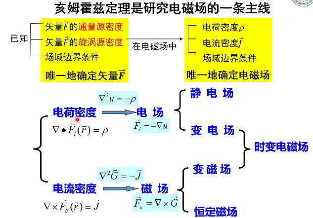

<!--more-->

$$\begin{align*}
\newcommand{\dif}{\mathop{}\!\mathrm{d}}
\newcommand{\p}{\partial}
\end{align*}
$$

## 矢径

我们定义**失径**为由参考点指向某一点的矢量。当参考点是原点时，矢径就是位置矢量。

在球坐标下，失径就是 $\vec{R}=\vec{r}-\vec{r}'$，比直角、柱坐标都简单，所以我们下面的都在球坐标系中讨论。

### 失径的三度

1. 矢径的梯度：$\nabla R=\hat{a}_r=\dfrac{\vec{R}}{R}$
2. 矢径的散度：$\nabla\cdot\vec{R}=3$
3. 矢径的旋度：$\nabla\times\vec{R}=0$

## 亥姆霍兹定理

&emsp;&emsp;位于某一区域中的矢量场，当其散度、旋度以及边界上场量的切向分量或法向分量给定后，则该区域中的矢量场被惟一地确定。

&emsp;&emsp;已知散度和旋度代表产生矢量场的源，可见惟一性定理表明，矢量场被其源及边界条件共同决定的。

&emsp;&emsp;矢量空间中只存在两种源：通量源（发散源）和漩涡源。那么我们知道了通量源和漩涡源，就能唯一确定一个场。这就是亥姆霍兹定理。

***亥姆霍兹定理***
: 矢量场 $\vec{F}$ 由其散度、旋度和边界条件惟一确定。
: 更具体地，一个矢量场可以表示为一个无旋的散度场和一个无散的旋度场的叠加，即：$\vec{A}=\vec{A}_1+\vec{A}_2$，其中，$\nabla\times \vec{A_1}=0$，$\nabla\cdot \vec{A_2}=0$
: 再根据梯旋散公式，矢量场可以表示为：$\vec{F}=-\nabla\Phi+\nabla\times\vec{A}$

## 场的分类

|旋度|散度|类型|
|---|---|---|
|=0|≠0|无旋有散场|
|≠0|=0|有旋无散场|
|≠0|≠0|有旋有散场|
|=0|=0|无旋无散场|

### 无旋无散场

$\nabla\cdot \vec{f}=0$ 和 $\nabla\times\vec{f}=0$，则可用标量的梯度表示：$\vec{f}=-\nabla \phi$，并且满足：

$$
拉普拉斯方程：\nabla^2 \phi =0
$$

因此可以通过求解拉普拉斯方程和边界条件构成的定解问题求得 $\phi$，然后由 $\vec{f}=-\nabla \phi$ 求得 $\vec{f}$

### 无旋有散场

$\nabla\cdot \vec{f}\neq0$ 和 $\nabla\times\vec{f}=0$，则可用标量的梯度表示：$\vec{f}=-\nabla \phi$，由因为 $\nabla\cdot\vec{f}=\rho$，所以满足：

$$
泊松方程：\nabla^2 \phi =-\rho
$$

因此可以通过求解泊松方程和边界条件构成的定解问题求得 $\phi$，然后由 $\vec{f}=-\nabla \phi$ 求得 $\vec{f}$

### 有旋无散场

$\nabla\cdot \vec{f}=0$ 和 $\nabla\times\vec{f}\neq0$，则可用另一矢量的旋度表示：$\vec{f}=-\nabla \times \vec{A}$，并且满足：

$$
\nabla\times\vec{f}=\vec{J}\\
\nabla\times\nabla\times\vec{A}=\vec{J}\\
\nabla(\nabla\cdot\vec{A})-\nabla^2 \vec{A}=\vec{J}
$$

根据亥姆霍兹定理，要使 $\vec{A}$ 唯一，必须定义其散度。一般采用库伦规范条件 $\nabla\cdot\vec{A}=0$（见第二章内容），则有：

$$
矢量泊松方程：\nabla^2 \vec{A}=-\vec{J}
$$

通过求解矢量泊松方程和边界条件构成的定解问题求得 $\vec{A}$

### 有旋有散场

$\nabla\cdot \vec{f}\neq0$ 和 $\nabla\times\vec{f}\neq0$，则可以将 $\vec{f}$ 分解为有旋无散场和有散无旋场：

$$
\vec{f}=\vec{f}_1+\vec{f}_2
$$

从而有：

$$
\vec{f}=\nabla\times\vec{A}-\nabla\phi
$$

---

