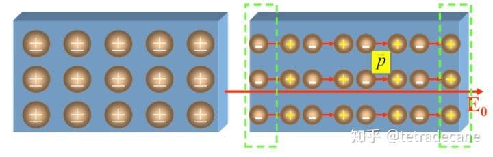
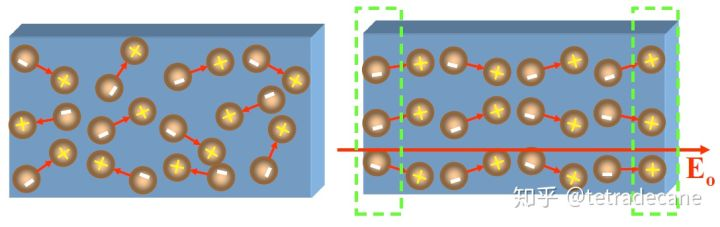

<!--more-->

## 静电场中的导体

导体中含有自由电子，在电场作用下，电荷重新分布，直到电荷产生的附加电场与外加电场相互抵消为止。此时，导体内的电荷不再做宏观的移动，此时称为**静电平衡**，此时的导体就有如下性质：

1. 导体内的电场强度应为 0（否则电荷会移动，就不是静电平衡）
2. 导体是一个等位体，其表面是等位面（电场强度为0）
3. 电场强度方向与导体表面垂直（导体表面是等位面）
4. 若导体本身带有净电荷，则这些电荷必定分布于导体表面（否则不满足 1.）

## 电介质

### 电偶极子

两个距离很近的等值异号电荷称为**电偶极子**

<!-- 

 -->

考虑在空间中一点 $P$ 的电位。根据电电荷的电位公式：

$$
\phi=\frac{q}{4\pi\varepsilon_0}(\frac{1}{r_1}-\frac{1}{r_2})\\
=\frac{q}{4\pi\varepsilon}\frac{r_2-r_1}{r_1 r_2}
$$

当 $P$ 电较远时，即 $r<< d$ 时，有：

$$
r_2-r_1\approx l\cos\theta\\
r_1r_2\approx r^2
$$

于是有：

$$
\phi=\frac{ql\cos\theta}{4\pi\varepsilon_0 r^2}=\frac{\vec{p}\cdot\vec{r}}{4\pi\varepsilon_0 r^3}
$$

$\vec{p}=q\vec{l}$ 称为电偶极子的电偶极距，其方向由 -q 指向 +q.

> 本来矢径应该用 $R$ 的，但是为了和图保持统一，故用 $r$

### 有极分子/无极分子

分子有两类：**有极分子**与**无极分子**，其区别在于分子内部正负电荷的作用中心是否重合。

在外电场的作用下，电介质发生极化：
1. 无极分子的正负电荷中心发生相对位移，形成与外电场方向一致的电偶极子。称为**位移极化**；
2. 有极分子发生转动，使得方向与外电场方向一致。称为**转向极化**；

<!--  -->

极化后产生的电荷称为**极化电荷**，也叫**束缚电荷**。极化电荷只能抵消部分外电场，无法将其消除。为了计算场强，我们定义**极化强度**为单位体积内的电偶极距：

$$
\vec{P}=\lim_{\Delta V\rightarrow0}\frac{\sum_i \vec{p}_i}{\Delta V} \;\text{单位 C/m^2}
$$

那么体积元内的电偶极子 $\dif \vec{p}=\vec{P}\dif V'$ 的电位为：

$$
\dif \phi =\frac{1}{4\pi\varepsilon_0} \frac{\dif \vec{p}\cdot\vec{R}}{R^3}=\frac{\dif V'}{4\pi\varepsilon_0}\vec{P}\cdot \left( \nabla'\frac{1}{R} \right)\\
\phi(\vec{r}) =\int \dif \phi = \frac{1}{4\pi\varepsilon_0} \int_V \vec{P} \cdot \left( \nabla'\frac{1}{R} \right)\dif V'
$$

由矢量恒等式 $\vec{P}\cdot\left( \nabla'\frac{1}{R} \right) = \nabla'\left(\vec{P}\cdot\frac{1}{R} \right)-\frac{1}{R} \nabla'\cdot\vec{P}$，我们有：

$$
\begin{align}
\phi(\vec{r})&= \frac{1}{4\pi\varepsilon_0} \int_V \left[\nabla'\left(\vec{P}\cdot\frac{1}{R} \right)-\frac{1}{R} \nabla'\cdot\vec{P} \right] \dif V'\\
高斯定理：&=\frac{1}{4\pi\varepsilon_0} \oint_S \frac{\vec{P}\cdot\dif \vec{S}'}{R}+\frac{1}{4\pi\varepsilon_0} \int_V\frac{-\nabla'\cdot\vec{P}}{R}\dif V'
\end{align}
$$

我们对比真空中的电位公式：$\phi =\frac{1}{4\pi\varepsilon_0} \int \frac{\rho(r')}{R}$ 可以看出，等号右边的两部分分别是极化电荷的等效面密度与等效体密度。即：

$$
\rho_{sp}=\vec{P}\cdot\vec{n}\\
\rho_{p}=-\nabla'\cdot \vec{P}=-\nabla\cdot \vec{P}
$$

### 各向同性/异性的电介质

实验结果表明，若电介质极化强度 $\vec{P}$ 与外加电场强度 $\vec{E}$ 有如下关系：

$$
\vec{P}=\chi_\varepsilon \varepsilon_0 \vec{E}
$$

则称为**各向同性的电介质**，即无论外加电场方向，其极化强度的数值都相同。反之，若不同方向的极化强度值不同，则称为 **各向异性的电介质**。

## 电介质中的高斯通量定理

