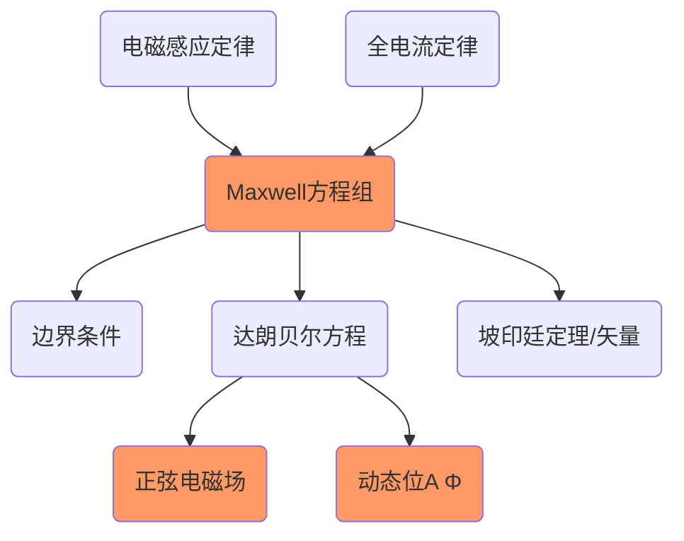

<!--more-->

$$
\begin{align*}
\newcommand{\dif}{\mathop{}\!\mathrm{d}}\\
\newcommand{\p}{\partial}\\
\newcommand{\bd}{\boldsymbol}\\
\newcommand{\db}[1]{\dot{\boldsymbol{#1}}}\\
\newcommand{\E}{\mathscr{E}}
\end{align*}
$$

